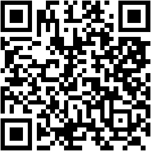

# 📝 To-Do List App

A super simple and minimal To-Do List web app using HTML, CSS, and JavaScript.

## 🚀 Features

- Add tasks
- Delete tasks
- Tasks are saved in `localStorage`
- Clean and responsive UI

## Link 🔗 : [To-Do List App](https://project-to-do-list-app.netlify.app/)

## 📱 QR Code

Scan this QR code to quickly access the project:

<p align="center">
  
</p>

<!--
## 📷 Preview


## 📁 How to Use

1. Clone the repository:
   ```bash
   git clone https://github.com/chdsssbaba/Project-To-Do-List-App.git
   cd Project-To-Do-List-App
